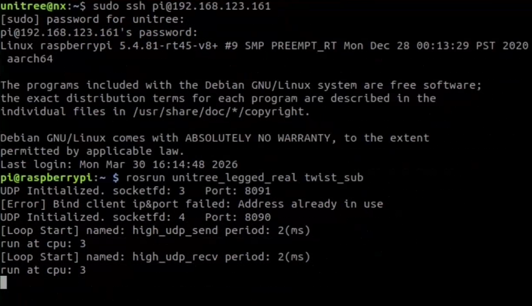

# Unitree Go1 SLAM Navgation Document


## Network & Remote Control Setup

- Make sure your workstation and the Unitree Go1 robot are connected to the same WiFi network.

- Make sure that NoMachine is properly installed on your workstation.

    About the NoMachine, you can install it by this link: https://www.nomachine.com/

    It supports installation across multiple brands and various operating systems.

- Establish a remote desktop connection

    Connect to the robot using NoMachine. Open the interface and click the corresponding device to establish a connection.
    This process will require you to enter your username and password.
    
    - Username: unitree
    - Password: 123

- After a successful connection, unlock the remote desktop

    You will be prompted to enter the password again during this process.
    
    - Password: 123


## Unitree Go1 ROS High-Level topic Control

- Enter the Unitree Go1's Raspberry Pi.
    Launch a terminal, Run the following commands.    
    ```
    sudo ssh pi@192.168.123.161
    ```
    - Password: 123

- Run the `rosrun` command.
    ```
    rosrun unitree_legged_real twist_sub
    ```

- Overall Process Demonstration
    Upon successful startup, you will see the following interface.
    


## Unitree Go1 SLAM Navgation

- Launch the mapping and navigation ROS package via the ROS launch file.
    Open another terminal, Run the following commands.
    ```
    roslaunch slam_planner slam_planner_online.launch
    ```
    Upon successful execution, an interactive visual interface of RViz will be launched.

- Scan the environment and generate a map.
    In the RViz interface, you can view the areas that have been scanned. Use the remote controller to move the Unitree Go1 robot around the environment, which will expand and build a complete map.
    

- Set target points to perform path planning, navigation and movement.
    - Click the **2D Nav Goal** button in the RViz interface.
        
        As shown in the part circled by the blue circle as shown in the figure.
    
    - Set the target point.
        Use the mouse twice:
        
        First, click on the destination on the map without releasing it to set the robot's target position.
        
        Second, keep holding and drag in a direction to set the robot's target pose.

        As shown in the figure.
        
    
    - Overall Process Demonstration
        You will see a red arrow representing the robot's current position and pose gradually moving toward the newly set target point.
        
    
