# Unitree Go1 SLAM Navgation Document
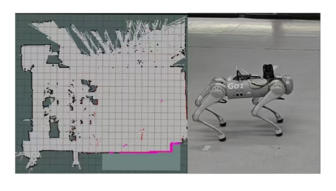

## Unitree Go1 Robot Hardware Setup

- Launch the robot dog:
    To power on the robot, you need to press the power button twice. 
    Press it briefly the first time and hold it down for a longer time the second time.

- Make sure the lidar is working properly:
    - First, when the radar is turned on, there will be a startup waiting time of about 40 seconds. During this period, the indicator light of the radar will keep flashing yellow. As shown in the figure:
    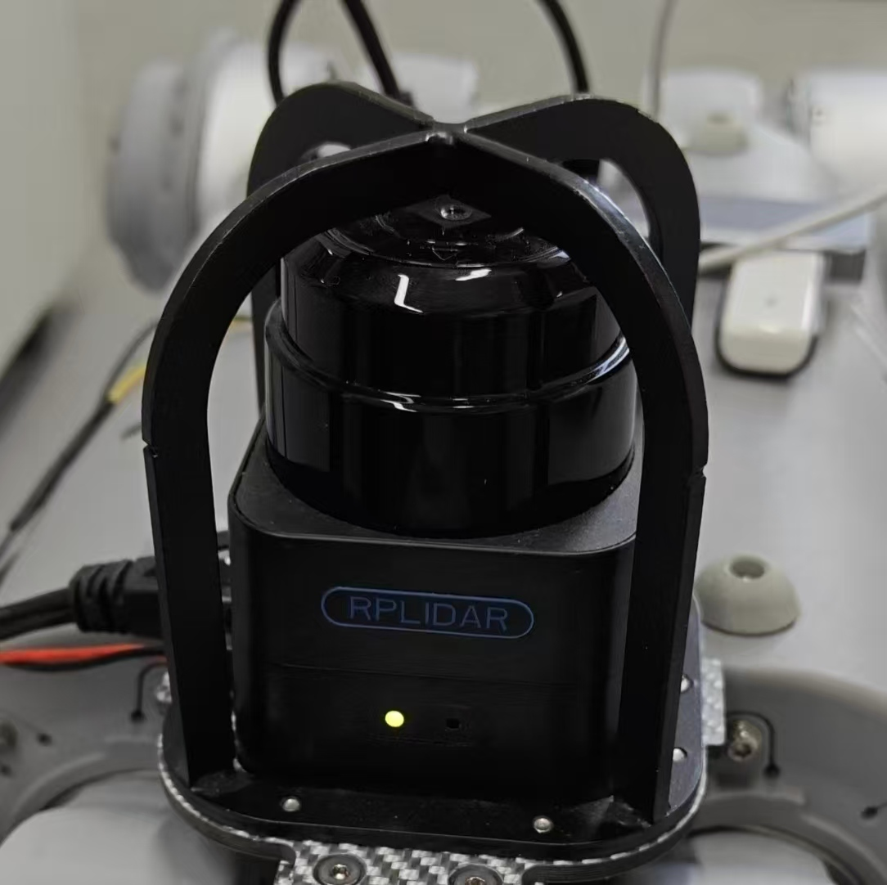

    - If correct. The radar indicator light will show green. As shown in the figure:
    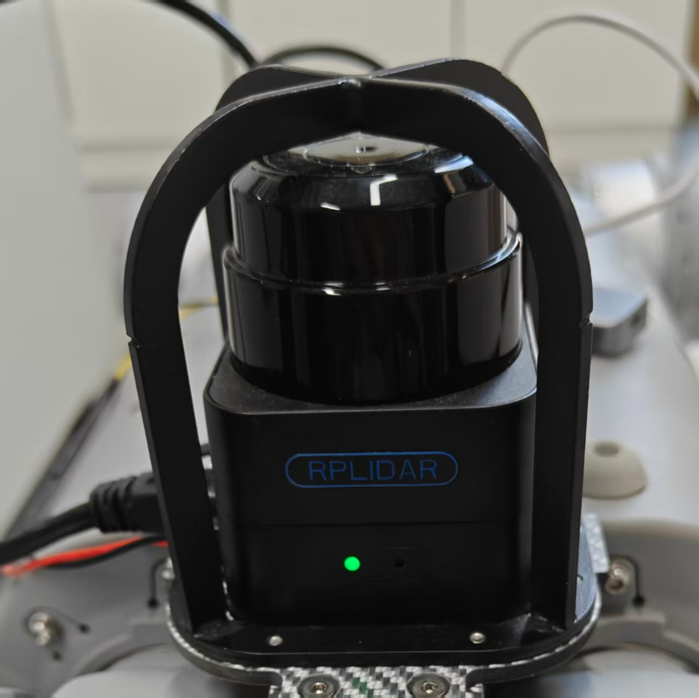

    - If ERROR! The radar indicator light will show red. As shown in the figure:
    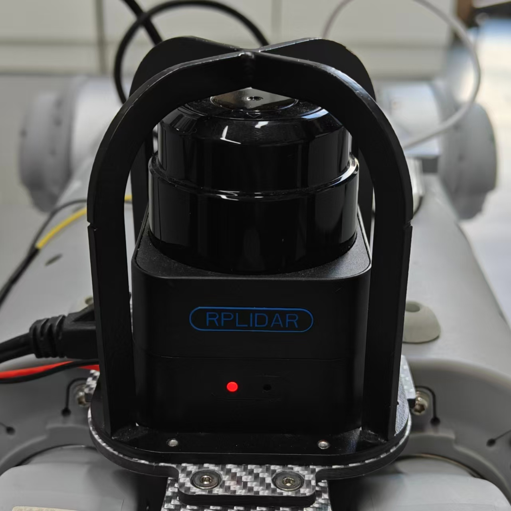

    - One solution is to remove the USB power cord and Ethernet data cable of the radar. Then, reinsert.

## Unitree Go1 Robot Software Setup

### Unitree_ros_to_real

- Copy folder "nano_ros_ws" of this repo to the "home" folder of main nano (unitree@192.168.123.15) on the Unitree Go1 robot.

- Compile this ROS package:
    1. Enter the folder "nano_ros_ws":
    ```
    cd nano_ros_ws
    ```
    2. Compile. Run command:
    ```
    catkin_make
    ```
    3. Add source to the .bashrc:
    ```
    echo "source ~/nano_ros_ws/devel/setup.bash" >> ~/.bashrc
    ```

### UnitreeSLAM

- Copy folder "UnitreeSLAM" of this repo to the "home" folder of main nano (unitree@192.168.123.15) on the Unitree Go1 robot.
    1. Enter the folder "catkin_lidar_slam_2d_go1":
    ```
    cd /UnitreeSLAM/catkin_lidar_slam_2d_go1/
    ```
    2. Compile. Run command:
    ```
    catkin_make --pkg slam_planner_sdk slamware_sdk
    ```
    3. Add source to the .bashrc:
    ```
    echo "source ~/UnitreeSLAM/catkin_lidar_slam_2d_go1/devel/setup.bash" >> ~/.bashrc
    ```

## Network & Remote Control Setup

### WiFi Settings

Before setting up the WiFi remote control, we must make the settings through the physical screen.
    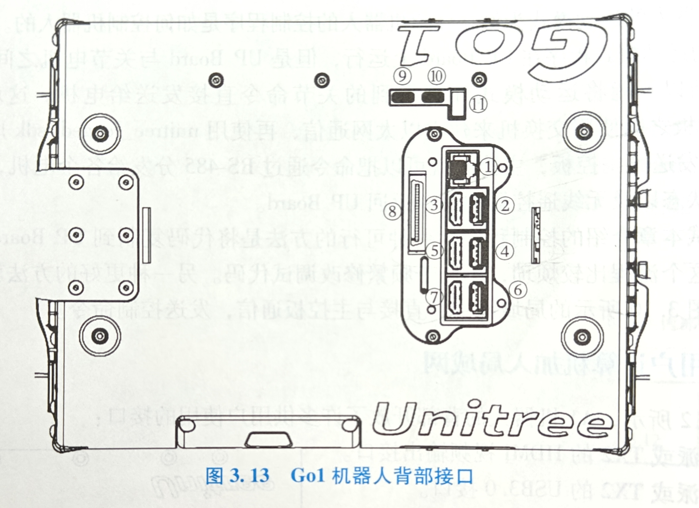

- Connect the HDMI cable to position No.5 in the image.

- Connect the USB docking station and mouse keyboard to position No.4 in the image.

- Connect to the WiFi you want.

- Launch a terminal, Run the following commands to check the IP.

    ```
    ifconfig
    ```

- The IP address of wlan0 is the one you need to use.

- If you find that the connection is frequently disconnected during use. Please follow the instructions below. If not please ignore.

    Launch a terminal, Run the following commands:

    ```
    sudo nano /etc/NetworkManager/conf.d/default-wifi-powersave-on.conf
    ```

    Change `wifi.powersave = 3` to `wifi.powersave = 2` (2 indicates disabled). Then restart the service:

    ```
    sudo systemctl restart NetworkManager
    ```

    Force USB not to enter power-saving mode:

    ```
    sudo sh -c 'echo -1 > /sys/module/usbcore/parameters/autosuspend'
    ```

### Nomachine

- Make sure your workstation and the Unitree Go1 robot are connected to the same WiFi network.

- Make sure that NoMachine is properly installed on your workstation.

    About the NoMachine, you can install it by this link: https://www.nomachine.com/

    It supports installation across multiple brands and various operating systems.

- Launch Nomachine. Click one the "Add" button as shown in the image.
    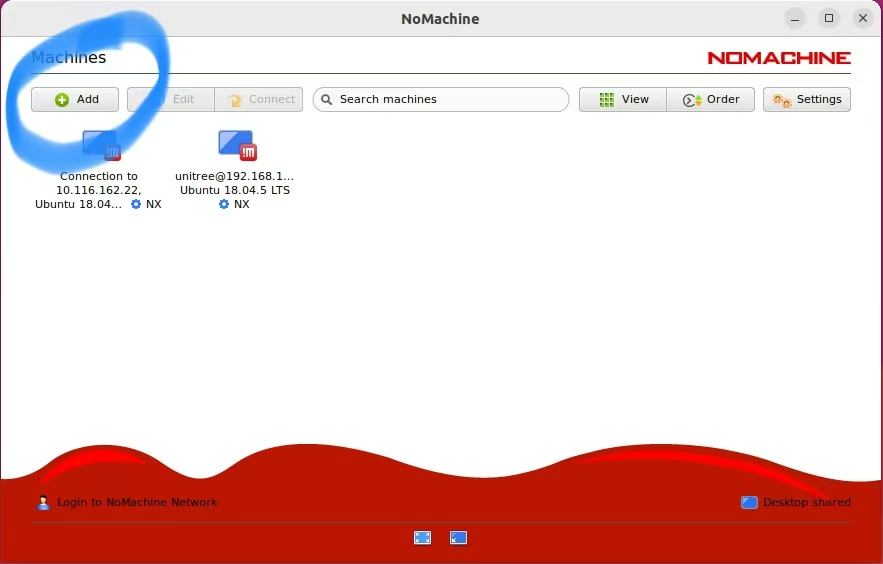

- Next, Click on the "Add connection" button.

- Next, Enter the IP address you just obtained at the "Host".

- Establish a remote desktop connection

    Connect to the robot using NoMachine. Open the interface and click the corresponding device to establish a connection.
    This process will require you to enter your username and password.
    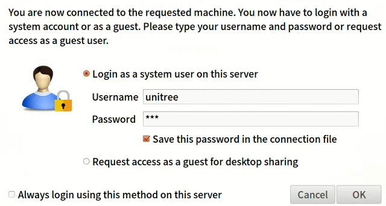
    - Username: unitree
    - Password: 123

- After a successful connection, unlock the remote desktop

    You will be prompted to enter the password again during this process.
    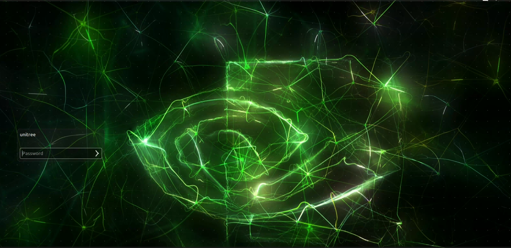
    - Password: 123

- Adjust the display resolution. Run the following commands:
    ```
    xrandr --fb 1080x720
    ```
    You can adjust the different resolutions according to your needs.

## Unitree Go1 ROS High-Level topic Control

- Launch a terminal, Run the following commands.    

- Run the `rosrun` command.
    ```
    rosrun unitree_legged_real twist_sub
    ```


## Unitree Go1 SLAM Navgation

- Launch the mapping and navigation ROS package via the ROS launch file.
    Open another terminal, Run the following commands.
    ```
    roslaunch slam_planner slam_planner_online.launch
    ```
    Upon successful execution, an interactive visual interface of RViz will be launched.

- Scan the environment and generate a map.
    In the RViz interface, you can view the areas that have been scanned. Use the remote controller to move the Unitree Go1 robot around the environment, which will expand and build a complete map.
    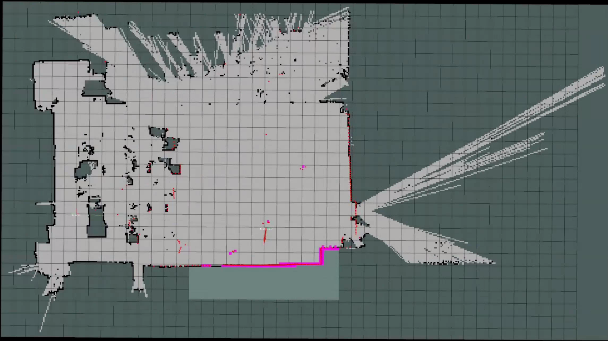

- Set target points to perform path planning, navigation and movement.
    - Click the **2D Nav Goal** button in the RViz interface.
        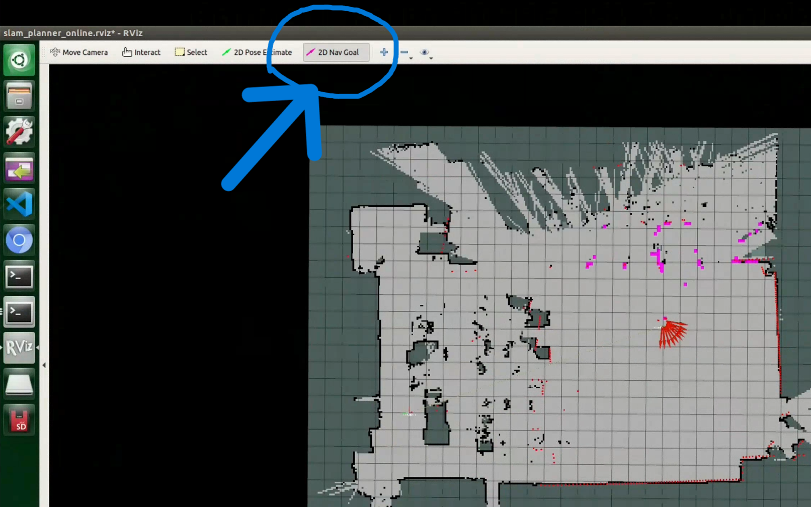
        As shown in the part circled by the blue circle as shown in the figure.
    
    - Set the target point.
        Use the mouse twice:
        
        First, click on the destination on the map without releasing it to set the robot's target position.
        
        Second, keep holding and drag in a direction to set the robot's target pose.

        As shown in the figure.
        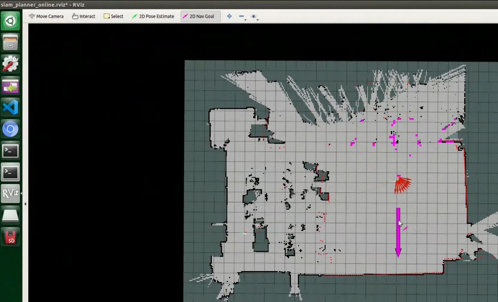
    
    - Overall Process Demonstration
        You will see a red arrow representing the robot's current position and pose gradually moving toward the newly set target point.
        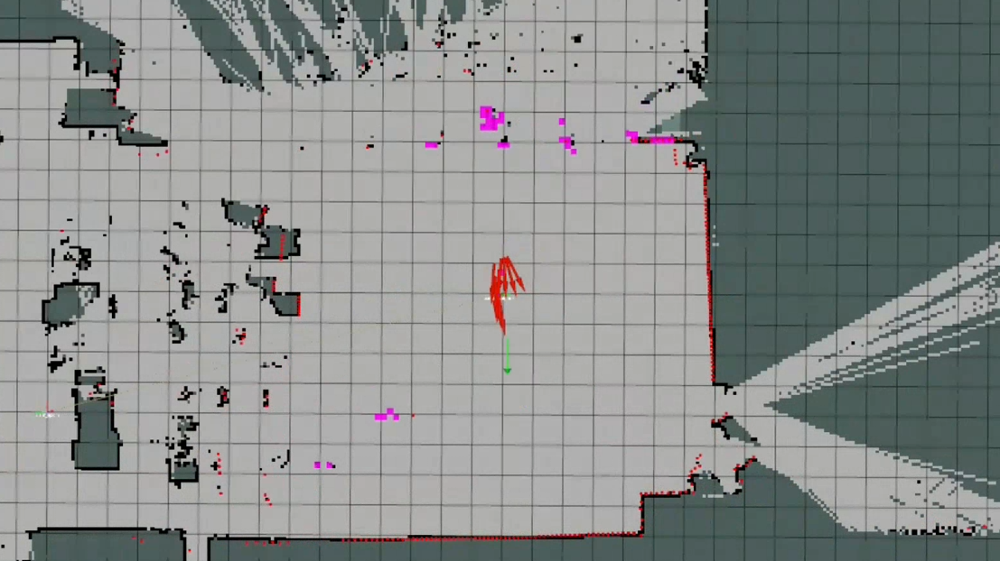
    
