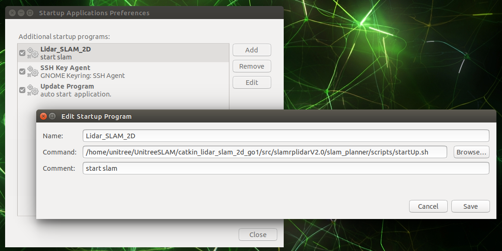

# Go1NX的运动程序SDK和激光SLAM程序的更新

## 更新NX的运动程序SDK
将附件`unitree_legged_sdk-3.4.2.zip`解压并重命名为NX下如下路径: 
`~/Unitree/sdk/unitree_legged_sdk`。

解压后`unitree_legged_sdk`文件夹下应该包含`include`, `lib`和`examples`等内容。

## 更新SLAM程序包
将附件`UnitreeSLAM`解压至NX下如下home路径：
`~`

## 2DSLAM自启动设置
2D SLAM包位于`~/UnitreeSLAM/catkin_lidar_slam_2d_go1`下。

打开`Startup Application`程序，将2DSLAM启动项的脚本路径修改为：
`/home/unitree/UnitreeSLAM/catkin_lidar_slam_2d_go1/src/slamrplidarV2.0/slam_planner/scripts/startUp.sh`。

示意图如下：

## 3DSLAM配置
3D SLAM包位于`~/UnitreeSLAM/catkin_lidar_slam_3d`下。

使用手册见`~/UnitreeSLAM/catkin_lidar_slam_3d/src/user_manual/3D激光SLAM开发指南-V1.4.md`

