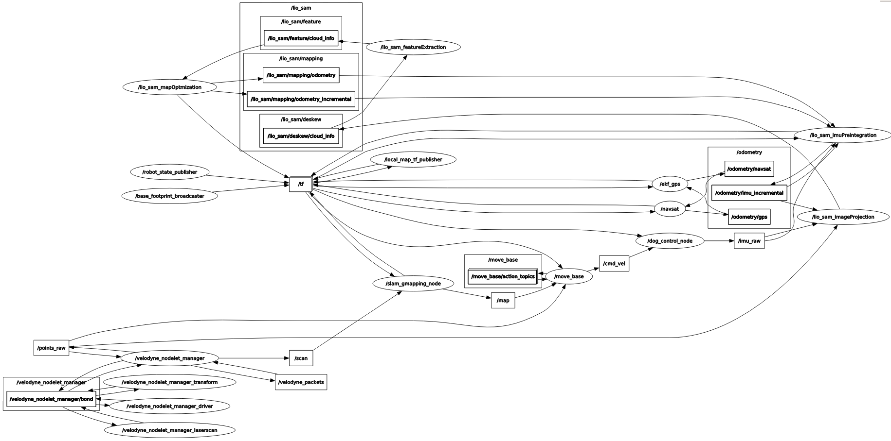
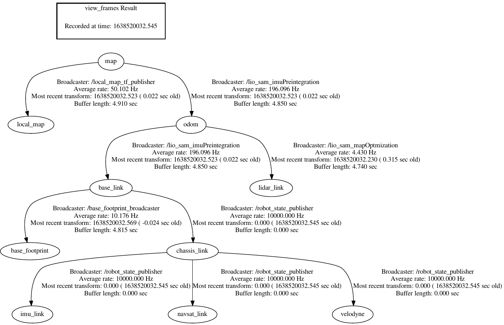
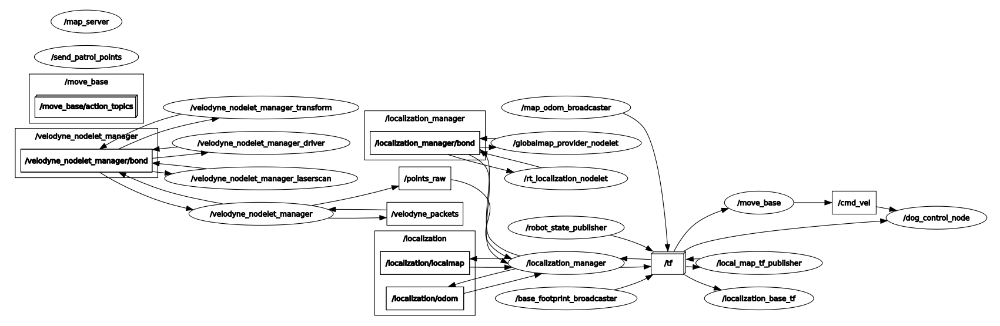
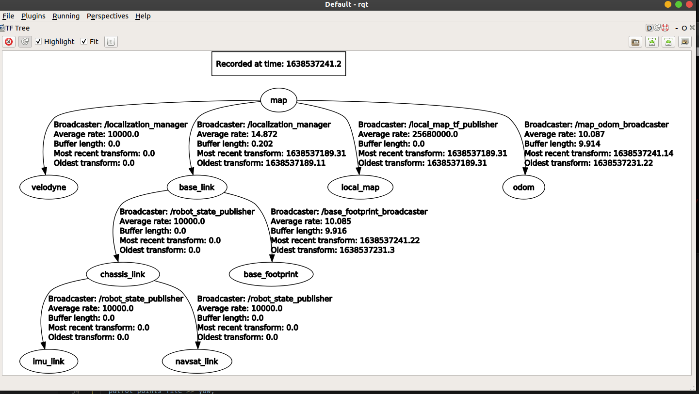
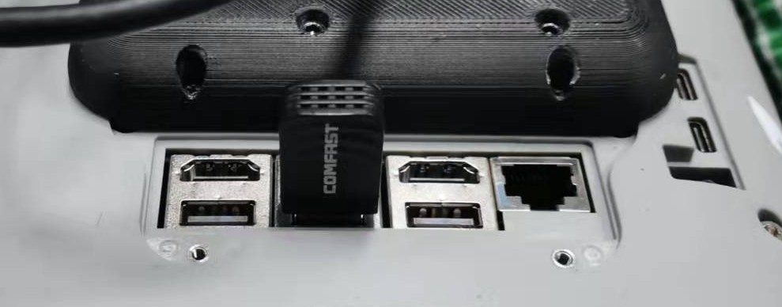

# 3D激光SLAM开发指南
<!-- TOC -->

- [3D激光SLAM开发指南](#3d激光slam开发指南)
  - [简介](#简介)
    - [3D激光SLAM算法](#3d激光slam算法)
    - [基于3D地图的定位](#基于3d地图的定位)
    - [路径规划与避障](#路径规划与避障)
    - [各软件包解读](#各软件包解读)
    - [运行节点图（使用velodyne-16线激光雷达）](#运行节点图使用velodyne-16线激光雷达)
  - [平台和传感器](#平台和传感器)
  - [依赖（默认无需用户安装）](#依赖默认无需用户安装)
    - [ROS](#ros)
    - [gtsam-4.0.2](#gtsam-402)
    - [unitree_legged_sdk](#unitree_legged_sdk)
    - [controller-manager](#controller-manager)
    - [libpcap-dev](#libpcap-dev)
    - [openslam_gmapping](#openslam_gmapping)
    - [pcl_ros](#pcl_ros)
    - [tf_conversions](#tf_conversions)
    - [libmetis](#libmetis)
    - [robot_state_publisher](#robot_state_publisher)
    - [robot_localization](#robot_localization)
    - [teb_local_planner](#teb_local_planner)
  - [编译安装（默认无需用户编译）](#编译安装默认无需用户编译)
    - [增加swap空间](#增加swap空间)
    - [编译](#编译)
    - [可能遇到的编译问题](#可能遇到的编译问题)
      - [Error 1: Conflict of `PCL` and `OpenCV`](#error-1-conflict-of-pcl-and-opencv)
      - [Error 2: `cv_bridge`](#error-2-cv_bridge)
  - [配置（默认无需用户配置）](#配置默认无需用户配置)
    - [配置计算机的静态IP](#配置计算机的静态ip)
    - [配置激光雷达的类型](#配置激光雷达的类型)
    - [配置机器人的footprint](#配置机器人的footprint)
  - [运行](#运行)
    - [建图](#建图)
    - [巡逻](#巡逻)
    - [机器人的远程可视化](#机器人的远程可视化)

<!-- /TOC -->

## 简介

### 3D激光SLAM算法
本套程序建图时使用`LIO-SAM`算法作为激光雷达SLAM 算法，其紧密耦合了激光雷达的数据和机器狗自身反馈的`IMU` 数据，实现了同步定位与建图功能。
如需进一步了解 `LIO-SAM` 算法并在此基础上开发，可参考[原论文](https://arxiv.org/abs/2007.00258)以及[Github仓库](https://github.com/TixiaoShan/LIO-SAM)中的介绍。

### 基于3D地图的定位
巡逻时会加载建图时构建好的地图，使用 `NDT` 算法进行 3D 点云匹配定位，此算法需要提供大概的初始位姿信息（默认所有值为 0 ，因此启动巡逻时的机器狗初始位姿需要与启动建图时的初始位姿相同），巡逻时不会运行 `LIO-SAM` 算法。

### 路径规划与避障
路径规划以及避障使用了ROS的 `navigation` 包，并以 `teb_local_planner` 作为局部路径规划器。

同时使用了 `gmapping` 构建 2D 全局地图以进行全局路径规划（ LIO-SAM 也会生成全局地图，并被用于巡逻时的定位，但其不适用于有高度差环境的全局路径规划）。

### 各软件包解读

|Package|Function|
|---|---|
|gmapping | 构建用于全局路径规划的2D全局地图，与源程序不同，源码有所修改，gmapping 的 odom 使用 lio-sam 的 odom。|
|lio_sam | SLAM 算法，参数在 config/params.yaml 下修改，源码有所修改。|
|navigation | 调用 move_base 的 launch 文件以及参数配置，机器人的运动表现很大程度取决于这里的配置。|
|ndt_localization | 巡逻时的定位算法。|
|start | 启动任务的 launch 文件，以及一些起“胶水”作用的小程序，比如巡逻点的发布。|
|a2_ros2udp| 与机器狗运动程序SDK进行通信的节点。|
|velodyne | 启动velodyne激光雷达的驱动程序。|
|rslidar| 启动robosense激光雷达的驱动程序。|

### 运行节点图（使用velodyne-16线激光雷达）
建图时的ROS节点图：



建图时的ROS TF树：


巡逻时的ROS节点图：


巡逻时的ROS TF树：


## 平台和传感器
本软件支持适配的机器人平台为：
- `Unitree A1`
- `Unitree Go1`
- `Unitree Aliengo`

本软件支持使用的传感器为：
- Velodyne公式的`Vledyne VLP-16`激光雷达。
- 速腾聚创的`RS-Lidar-16`激光雷达。
  
## 依赖（默认无需用户安装）
注意：
- 在发货版本的机器狗上，所有依赖均已经默认配置完毕，无需用户再自行配置。

### ROS
官方安装步骤参考： 
- <http://wiki.ros.org/melodic/Installation/Ubuntu>

使用国内源安装步骤如下：
```sh
sudo sh -c '. /etc/lsb-release && echo "deb http://mirrors.tuna.tsinghua.edu.cn/ros/ubuntu/ $DISTRIB_CODENAME main" > /etc/apt/sources.list.d/ros-latest.list'

sudo apt-key adv --keyserver 'hkp://keyserver.ubuntu.com:80' --recv-key C1CF6E31E6BADE8868B172B4F42ED6FBAB17C654

sudo apt update

sudo apt install ros-melodic-desktop-full

echo "source /opt/ros/melodic/setup.bash" >> ~/.bashrc

source ~/.bashrc

sudo apt install python-rosdep python-rosinstall python-rosinstall-generator python-wstool build-essential

sudo apt install python-rosdep

sudo rosdep init

rosdep update
```

### gtsam-4.0.2

The official website of `GTSAM` is here: 
- [GTSAM](https://github.com/borglab/gtsam/releases)

Note: 
- here we need to install the specified version of `gtsam-4.0.2`, which is a prerequisite of [LIOSAM](https://github.com/TixiaoShan/LIO-SAM).
- The newest version of gtsam, such as 4.1 will cause compiling problem `/usr/bin/ld: cannot find -lBoost::timer`.

Steps to install gtsam-4.0.2 are as follows:
```shell
wget -O gtsam.zip https://github.com/borglab/gtsam/archive/4.0.2.zip

unzip gtsam.zip

cd gtsam-4.0.2/

mkdir build && cd build

cmake -DGTSAM_BUILD_WITH_MARCH_NATIVE=OFF -DGTSAM_USE_SYSTEM_EIGEN=ON ..

make -j4

sudo make install
```

### unitree_legged_sdk
Download address of the newest `unitree_legged_sdk`:
- <https://github.com/unitreerobotics/unitree_legged_sdk/releases>
  
Note that you should use the specific version of `unitree_legged_sdk` corresponding to the current dog model and the current `lidar_slam_3d` version.

Defaultly, the right version of `unitree_legged_sdk` is already configured in this project with corresponding dog model. So you don't have to configure it agian!

### controller-manager
```shell
sudo apt install ros-melodic-controller-manager
```

### libpcap-dev
```shell
sudo apt install libpcap-dev
```

### openslam_gmapping
```
sudo apt install ros-melodic-openslam-gmapping
```

### pcl_ros
```
sudo apt install ros-melodic-pcl-ros
```

### tf_conversions
```
sudo apt install ros-melodic-tf-conversions
```

### libmetis
```
sudo apt install libmetis-dev
```

### robot_state_publisher
```
sudo apt install ros-melodic-robot-state-publisher
```

### robot_localization
```
sudo apt install ros-melodic-robot-localization
```

### teb_local_planner
```
sudo apt install ros-melodic-teb-local-planner
```

## 编译安装（默认无需用户编译）

### 增加swap空间
`miniPC` 默认内存只有 4G，对于编译有点小，因此需要增加 swap 空间，以便快速通过编译。每次重启后 `swap` 空间会被删除，可使用 `free -h` 检查

新增16GB的swap空间的方法如下：
```
sudo dd if=/dev/zero of=/swapfile bs=64M count=256 status=progress

sudo chmod 600 /swapfile

sudo mkswap /swapfile

sudo swapon /swapfile

free -h
```

### 编译
将文件夹`catkin_lidar_slam_3d`放置于路径`~/UnitreeSLAM`下：

根据当前的机器狗类型，选择对应的运动程序的SDK版本，具体参考这里：
- [unitree_legged_sdk](#unitree_legged_sdk)

例如，对于`v2.0.2`版本的本程序，在`Go1`机器人上，需要修改`a2_ros2udp`包下`CMakeLists`文件的如下两行：
```
### For Go1
include_directories(~/UnitreeSLAM/sdk/unitree_legged_sdk-v20220117/include)
link_directories(~/UnitreeSLAM/sdk/unitree_legged_sdk-v20220117/lib)
```

编译：
```
cd catkin_lidar_slam_3d

catkin_make
```

### 可能遇到的编译问题
#### Error 1: Conflict of `PCL` and `OpenCV`
如果在编译时出现如下错误，则可能是因为PCL和OpenCV冲突的原因：
```
error: field ‘param_k_’ has incomplete type ‘flann::SearchParams’
```

解决方法参考如下链接：
- [PCL-OpenCV冲突的解决方案](https://blog.csdn.net/weixin_41698305/article/details/120651431)
- <https://github.com/strands-project/strands_3d_mapping/issues/67>

#### Error 2: `cv_bridge`
Error:
```sh
CMake Error at /opt/ros/melodic/share/cv_bridge/cmake/cv_bridgeConfig.cmake:113 (message):
  Project 'cv_bridge' specifies '/usr/include/opencv' as an include dir,
  which is not found.  It does neither exist as an absolute directory nor in
  '${{prefix}}//usr/include/opencv'.
```

解决方法:
- 因为NVIDIA的32.3.1.img文件把opencv文件命名成了opencv4
- 所以只需修改上述路径中的cv_bridgeconfig.cmke文件，把`/usr/include/opencv`改成`/usr/include/opencv4`

参考:
- <https://blog.csdn.net/qq_34213260/article/details/106226837>

## 配置（默认无需用户配置）

机器狗发货时默认已经进行了正确的参数配置。
但是为了确保机器人的参数配置正确，用户在收到机器狗后，最好检查一下如下配置是否正确。

### 配置计算机的静态IP
对于速腾聚创（RoboSense）生产的激光雷达，如`RS-LIDAR-16`和`RS-HELIOS_16p`：
- 出厂默认的激光雷达IP均为：`192.168.1.200`
- 默认的目标接收计算机的网络配置均为：
  - 静态IP地址：`192.168.1.102`
  - 子网掩码：`255.255.255.0`

在需要运行此程序的计算机上，增加一个与激光雷达目标IP一致的静态IP：
- 打开文件
```
$ sudo vim /etc/network/interfaces
```

- 增加如下内容（其中，`eth0`是当前网卡的名称，需要使用`ifconfig`确认）
```
auto eth0:1
iface eth0:1 inet static
name For Robosense Lidar
address 192.168.1.102
netmask 255.255.255.0
broadcast 192.168.1.255
```

- 重启此计算机，然后检查是否包含该静态IP：
```
$ ifconfig
```

- 检查是否可以从该计算机ping通激光雷达的IP地址，如果可以ping通，则配置正确。
```
$ ping 192.168.1.200

PING 192.168.1.200 (192.168.1.200) 56(84) bytes of data.
64 bytes from 192.168.1.200: icmp_seq=1 ttl=64 time=0.057 ms
64 bytes from 192.168.1.200: icmp_seq=2 ttl=64 time=0.044 ms
```

### 配置激光雷达的类型
如果是速腾聚创的激光雷达，需要打开文件`lidar_slam_3d/rslidar/rslidar_sdk_helios16p/config/config.yaml`。
在如下一行位置处，选择当前所使用的激光雷达类型，例如`RS16`或者`RSHELIOS_16P`：
```
lidar_type: RS16             #LiDAR type - RS16, RS32, RSBP, RSHELIOS, RSHELIOS_16P, RS128, RS80, RSRUBY_PLUS, RSM1, RSM2
```

### 配置机器人的footprint

机器人的footprint用于表示机器人的轮廓形状和大小，这里使用的是多边形的模型。
不同机器人的footprint参数均不同，因而根据当前机器人的实际尺寸形状配置好机器人的footprint参数是十分重要的，这使得机器人在进行路径规划时能够跟据自身的形状规划出更加合理的路径，避免碰撞到路径上的物体。

如对于B1机器狗，在文件夹`lidar_slam_3d/navigation/config/b1`下，用户首先需要检查配置文件`costmap_common_params.yaml`。
- 该文件示例内容如下：
```
footprint: [[0.50, 0.30], [-0.8, 0.30], [-0.8, -0.30], [0.50, -0.30]] 
```

- 其中，footprint后的参数即表示当前机器人构成的矩形形状的四个顶点在机器人坐标系`base_link`下的坐标。

## 运行
运行需要在机器狗的NX上运行，其ip地址为：
- `192.168.123.15` for `Go1`
- `192.168.123.12` for `A1`
- `192.168.123.220` for `Aliengo`
- `192.168.123.24` for `B1`

本软件的代码位于路径`~/UnitreeSLAM/catkin_lidar_slam_3d`。

以下运行操作均需要首先需要先进入该文件夹：
```sh
cd ~/UnitreeSLAM/catkin_lidar_slam_3d
```

在运行建图和巡逻之前，你需要确保如下条件被满足：
- 机器人处于运动模式下
- 机器人运动程序SDK`unitree_legged_sdk`的UDP连接没有被其它端口占用，例如`~/RobotVisionSystem`和`2D SLAM`。如果该端口被占用了的话，我们需要将占用该端口的程序关闭，否则我们将无法给机器人运动程序发送控制指令。


### 建图
打开一个命令行窗口，启动建图任务：
```sh
$ sudo su

$ source devel/setup.bash

$ roslaunch start build_map.launch map_name:=my_map_name
```

打开第二个命令行窗口，启动RVIZ可视化：
```sh
$ rosrun rviz rviz -d src/lidar_slam_3d/start/rviz/build_map.rviz 
```

建图时可使用控制器上的`X`键设置巡逻点，巡逻点保存在文件夹 `start/maps/gmapping` 下的 `txt` 文件里，每一行为一个巡逻点，每一行的三个值分别为：`x`，`y`，`yaw`（角度），`time`（停留时间）

### 巡逻
巡逻时需要在建图的起始位置启动巡逻任务（否则无法准确定位），机器狗会按照建图时设置的巡逻点依次巡逻。
- 首先将机器狗移动到建图初始时的位置和朝向处。

- 打开一个命令行窗口，启动巡逻任务:
```sh
$ sudo su 

$ source devel/setup.bash

$ roslaunch start start_patrol.launch map_name:=my_map_name
```

- 打开第二个命令行窗口，启动RVIZ可视化：
```sh
$ rosrun rviz rviz -d src/lidar_slam_3d/start/rviz/start_patrol.rviz
```

注意：
- 当运行`start_patrol.launch`，可能会报错提示没有从`map`坐标系到`base_link`坐标系的tf。这是因为`prm_localization`节点基于点云重定位时失败了，其原因主要是因为在运行巡逻程序前没有将机器狗放置于与建图初始时位置朝向一致的状态。

### 机器人的远程可视化

这里以`Go1`机器人为例。

<p align="center">

</p>

远程可视化通过ROS的多机通信实现。因此，需要将机器人的NX计算机与上位机连入同一个局域网，并对`ROS_MASTER_URI`和`ROS_IP`进行配置。
  
配置如下：
- 将一个Wifi接收器插入`Go1`机器人上`NX`计算机的USB口，如上图所示。
- 在`NX`计算机上，通过WiFi接收器连接到上位机所在的同一个局域网。
- 假设机器人接收端的IP为`192.168.1.76`，上位机的IP为`192.168.1.115`。
  可以互相ping一下确保网络通畅。
- 在`NX`上打开文件`~/.bashrc`进行如下配置，将机器人`NX`配置为`ROS Master`：
  ```
  export ROS_MASTER_URI=http://192.168.1.76:11311
  export ROS_IP=192.168.1.76
  ```

- 在上位机打开文件`~/.bashrc`进行如下配置，将其配置为从机。
  ```
  export ROS_MASTER_URI=http://192.168.1.76:11311
  export ROS_IP=192.168.1.115
  ```

- 然后，在上位机打开一个终端，使用`ssh`远程登录机器人`NX`，并进入3d slam程序路径下。
  ```
  ssh unitree@192.168.1.76
  ```
  ```
  cd ~/UnitreeSLAM/catkin_lidar_slam_3d
  ```

- 然后，按照前面[建图](#建图)或者[巡逻](#巡逻)中的启动方法，启动建图或者巡逻程序。

- 然后，在上位机上新开第2个终端，按照前面[建图](#建图)或者[巡逻](#巡逻)中的启动方法，远程启动建图或者巡逻的Rviz可视化。

