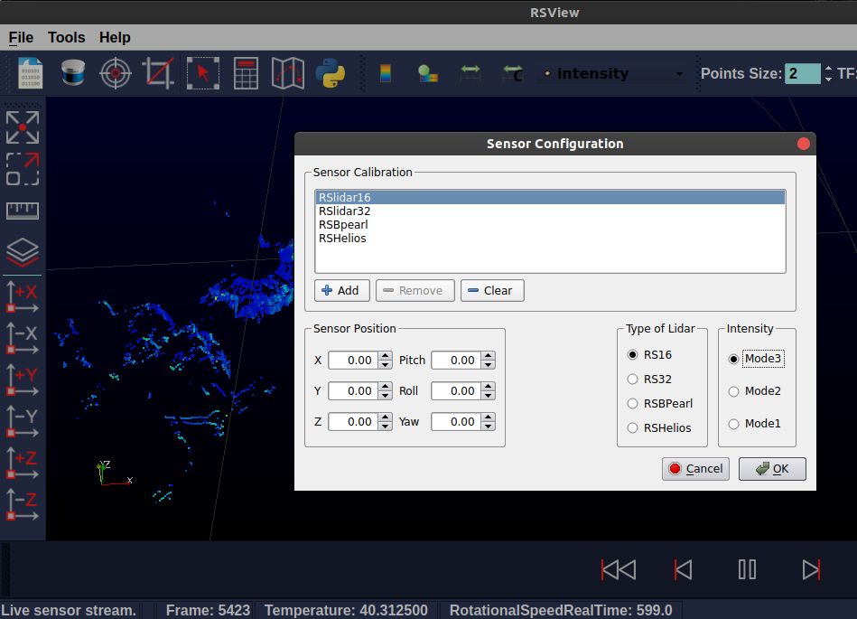
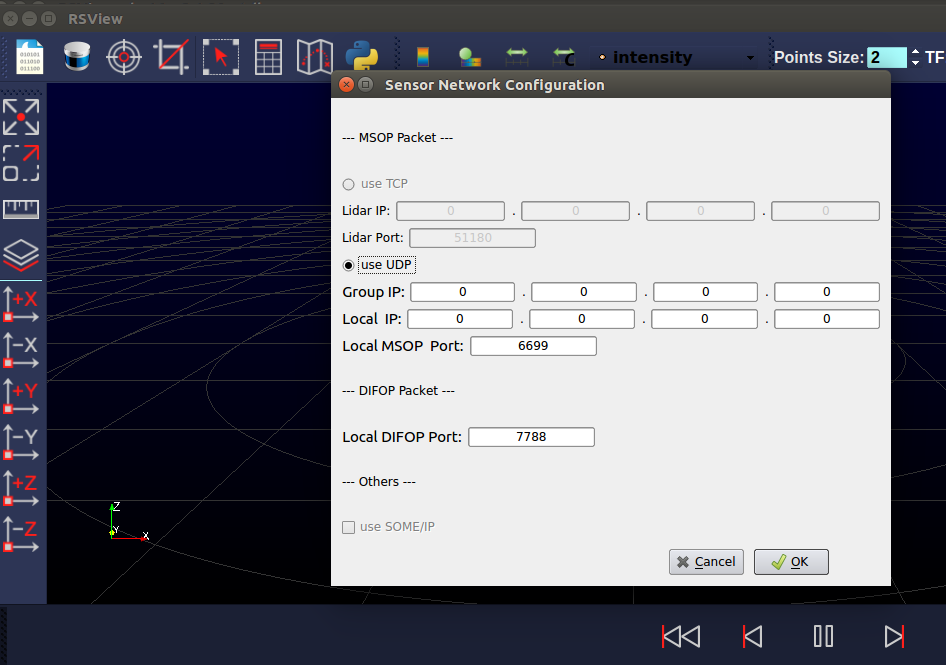
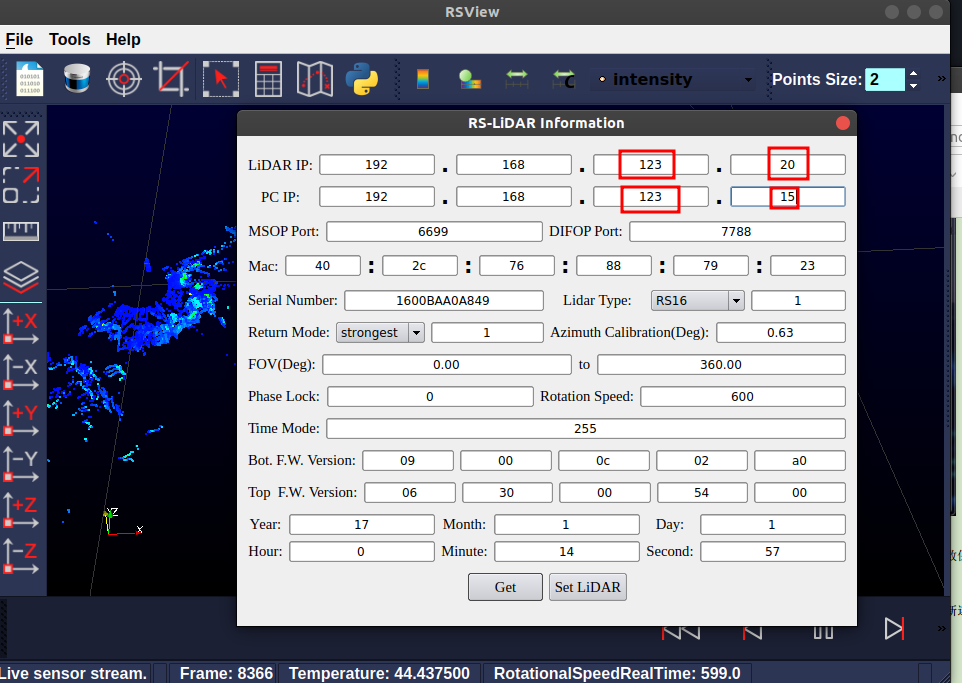
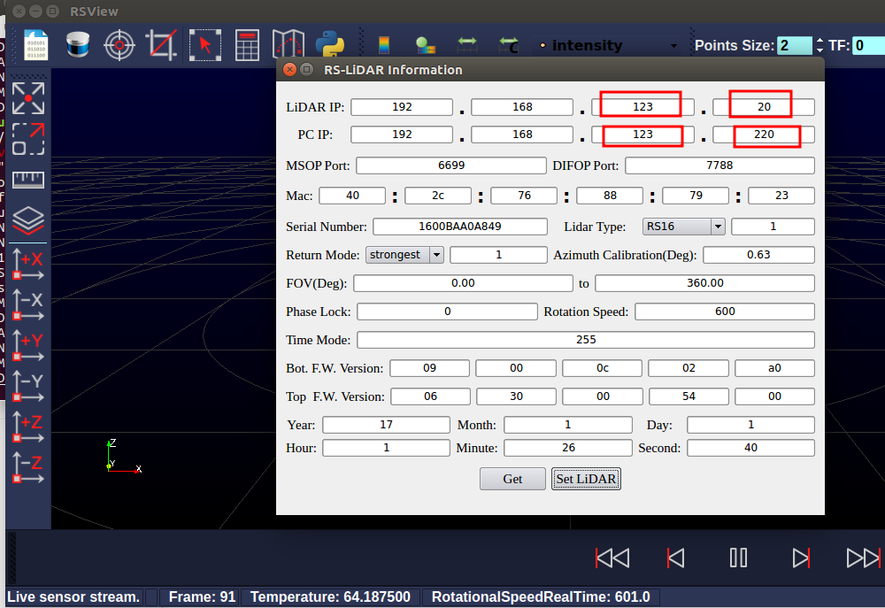

# RS-LiDAR-16激光雷达的IP配置
- [RS-LiDAR-16激光雷达的IP配置](#rs-lidar-16激光雷达的ip配置)
  - [下载安装`RSView`软件和官方用户手册](#下载安装rsview软件和官方用户手册)
  - [出厂默认的IP配置](#出厂默认的ip配置)
  - [使用`RSView`配置新的激光雷达IP](#使用rsview配置新的激光雷达ip)


- Author: Lingbo Meng
- Date: 2022/03/01

## 下载安装`RSView`软件和官方用户手册
下载地址：
- [速腾聚创官方资料下载地址](https://www.robosense.cn/en/resources-27)

本路径下默认附带了`RS-LiDAR-16 User Guide v4.3.3 CN`版本的用户手册。

## 出厂默认的IP配置
激光雷达出厂默认的激光雷达IP为：
- `192.168.1.200`

默认的目标接收计算机的网络配置为：
- 静态IP地址：`192.168.1.102`
- 子网掩码：`255.255.255.0`

## 使用`RSView`配置新的激光雷达IP

在配置`RS-LiDAR-16` 工厂固件的参数的时候，需要首先保证`RS-LiDAR-16`设备已经正常连接并且可以实时显示数据。

配置步骤如下：
- 运行`RSView` 
  ```
  ./run_rsview.sh
  ```

- 配置上位机网络为默认值。即静态IP地址：`192.168.1.102`，子网掩码：`255.255.255.0`：
  ```
  sudo ifconfig eth0 192.168.1.102/24

  sudo ifconfig eth0 up

  ifconfig
  ```

- 查看实时点云数据是否显示正常。点击【File】-->【Open】-->【Sensor Stream】。选择`RSlidar16`、`RS16`和`Mode 3`。显示界面如下图所示。

  

- 如果上一步没有显示点云，则可能是因为默认端口号错误，此时点击【Tools】-->【Sensor Network Configuration】。配置如下两个参数
  - `Local MSOP Port`: 6699
  - `Local DIFOP Port`: 7788
  - 界面如下

  

- 点击 【Tools】-->【RS-LiDAR Information】，会弹出配置窗口。 
  
- 点击窗口中 【Get】按钮， 会显示当前 `RS-LiDAR-16` 内部固件设定的参数。
  
- 我们可以在窗口中修改我们想设定的参数，然后点击 【Set LiDAR】。这里分别将激光雷达IP和上位机IP设置为：
  - `Lidar IP`: `192.168.123.20`
  - `PC IP`: 
    - `192.168.123.15` for `Go1`，
    - `192.168.123.12` for `A1`, 
    - `192.168.123.220` for `AlienGo`

  - 提示成功后，再次【Get】查看 `RS-LiDAR Information`确认参数是否被修改成功。

IP配置界面示意图如下：
- `Go1`IP配置完成界面
  

- `Aliengo`IP配置完成界面
  
