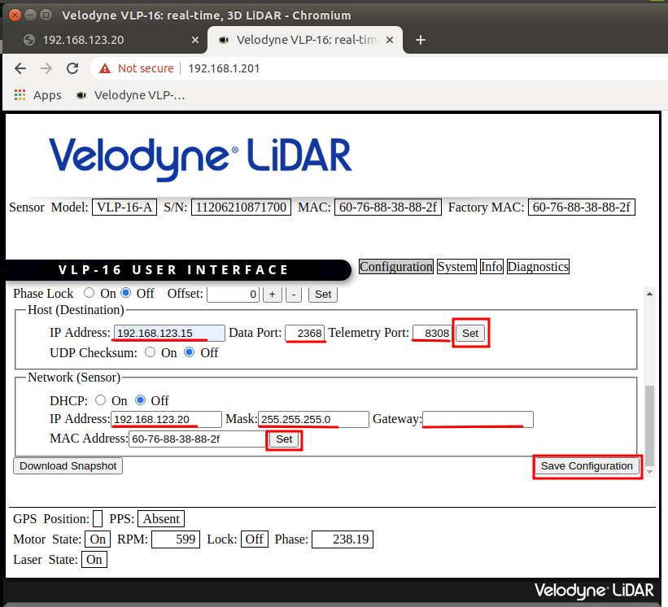

# Velodyne-VLP16激光雷达的IP配置

## 修改本地IP网段与激光雷达一致
```sh
$ sudo ifconfig eth0 192.168.1.100/24

$ sudo ifconfig eth0 up

$ ifconfig
```

## 打开Velodyne激光雷达的配置界面
激光雷达的原始IP为`192.168.1.201`。
打开Chrome浏览器，输入该IP，可打开Velodyne激光雷达的配置界面，并进行如下修改。

## 修改目标主机IP
修改`Host (Destination)`地址为当前NX的IP地址：
- IP Address: `192.168.123.15` for `Go1`, `192.168.123.12` for `A1`, 
- Data Port: `2368`
- Telemetry Port: 8308

修改完成后，点击`Set`按键保存。

## 修改激光雷达IP
修改`Network (Sensor)`激光雷达地址如下：
- IP Address: `192.168.123.20`
- Mask: `255.255.255.0`
- Gateway: 此处不填写

修改完成后，点击`Set`按键保存。

以`Go1`为例，修改后的配置界面如下图所示：


## 保存配置
最后，点击`Save Configuration`保存配置。

断电关机重启后，激光雷达IP配置方能生效。